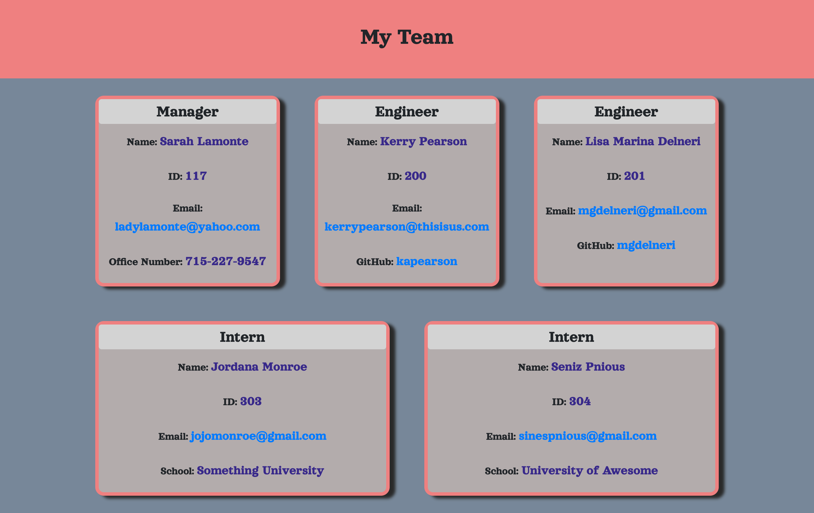

# Team-Profile-Generator

## GOAL

The goal of this project was to build a Node.js command-line application that prompts the user with questions about employees on a software engineering team. This information is then used to generate an HTML webpage with the employees' information. Another goal was to write unit tests for parts of the code and ensure that they all pass. 

The software engineering team has a manager, and then options of engineers and/or interns. Thus, part of the prompts include giving the user the option of adding engineers and interns, or to finish creating the team. 

The information collected for each type of employee was assigned as such:

* Manager: 
  * Name
  * Employee ID
  * Email address
  * Office number

* Engineer
  * Name
  * Employee ID
  * Email address
  * GitHub username

* Intern
  * Name
  * Employee ID
  * Email address
  * School

Other requirements were that when the user clicks on the email addresses generated on the webpage, by default the user's email program opens up and is populated with the email address. Also, when the user clicks on the GitHub username, the employee's GitHub profile opens in a new tab. 

## PROCESS

After reading and studying the requirements for this assignement, I created the repo and all of the folders and files necessary. Before doing any actual coding, I studied the past activities that were relevant to this project, and tried mapping out my strategy for attacking it. 

The first coding I did was to create a mock-up HTML file and style it with CSS. Once that was in place, I copied the HTML code into a generateHTML.js file as a template. 

I then started writing out the parent Employee class, followed by the Manager, Engineer, and Intern classes that were extending the parent class. 

After a lot of brainstorming and talking it over with both my tutor and classmates, I was able to start working on the logic in index.js. This involved using inquirer to write out all of the questions to be presented to the user about the team's employees. 

Before finalizing the actual generating of the HTML file, I coded the unit tests for all of the classes and tested them along the way. Once this was finished, I went back to the main index.js module and worked for a while on the logic that connected all of the data to the generateHTML template. 

Once everything was connected, I tested the application repeatedly and fixed bugs along the way. Once this was done, I looked over the code and made sure it was cleaned up and commented. 

Here is a link for the walkthrough video of the functionality of the Team Profile Generator app: 

[Team Profile Generator Walkthrough Video](https://drive.google.com/file/d/1Iz8OiR1Ma88zCDmuW5IQq8jzETsaxvNQ/view)

Here is an image of the generated HTML in the walkthrough video, with employee information as entered by the user (the employee information is not real, except for my own GitHub username used for the sake of showing functionality):

## INSTALLATION

In order to use this application, the user must have Node JS installed on their computer. Preferably the user is using a Mac OS, Windows, or Linux machine. 

## USAGE

In order to use the Team Profile Generator, the user must find the index.js main module of this project and open the command line pointing to this file. In the command line, the user should type "node index.js", which will bring up a series of prompts. After putting in information about the team's employees and completing the team, an HTML will be generated with the entered data. 

## CONCLUSION

This assignment was incredibly challenging. It took me many days to be able to start coding, and it became clear after a while that I had to break it up into many parts and attack them one by one. I was reminded once again of the value of collaboration and having others look over my code, as they might see things I have not noticed. 

Starting each section was a challenge, but once it got going, it became easier. The greatest challenge towards the end was making sure that all of the files were connected appropriately in the main module. This was especially difficult in the step of actually generating the HTML, or connecting the data entered by the user to the generateHTML template. 

There is always room for improvement. As an example, given more time, I would make sure that the office phone number was a link that could be clicked and defaulted to a local calling program. I would also add more information about each employee as well as add other types of employees to the list of options. 

Overall, this project was incredibly educational, not only in content, but in how to handle increasing and continuing frustrations when coding. Working through those hurdles now I believe will be invaluable when confronting them in the work force. 

